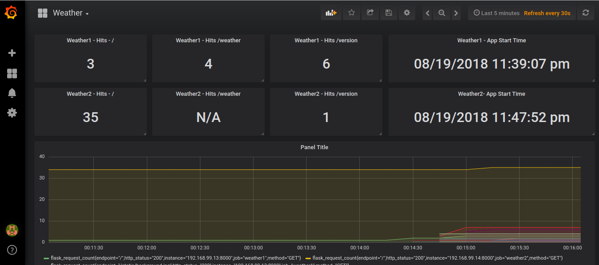

# Weather Challenge

##### Table of Contents  
* [The environment](#the-environment)
 * [The automation tools](#the-automation-tools-and-programs)
   * [Why these tools?](#why-these-tools)
  * [Starting the environment](#starting-the-environment)
      * [Requirements](#requirements)
      * [Starting the APP](#starting-the-app)
      * [Starting the Nginx (LB)](#starting-the-nginx-monitoring-and-load-balance)
  * [Using the APP](#using-the-app)
    * [Version](#version)
 * [Caching](#caching)
 * [Monitoring and Logging](#monitoring-and-logging)
 * [TO DO](#to-do)
---------------


That is the Weather Challenge APP. 
This app provides informations about the Weather forecast consulting the DarSky API. 

The app has the following endpoints:

**main page**

The main page collects the parameters to send to "weather" endpoint.
- Latitude and Longitude.
- Temperature/Wind unit: (Metric or Imperial).
- Temperature threshold (Optional)
- Wind threshold (Optional)


**/weather** 

- The current temperature, precipitation, humidity, and wind of today’s and next 2 days.
- Split the day to 2 sections: day and night.
- Warning if the weather/wind passed a specific threshold.
- The right gadget for that weather 


**/version**
- No paremeters, just the current version of th app.

## The environment

That is the APP structure: 


With this configuration is possible stop one app server to deploy without downtime.

## The automation tools and programs

To this project, I've used: 

|  Tool              | Why                          |
|----------------|-------------------------------|
|Ansible|Used to configure Prometheus and Grafana|
|Docker|Used to download/up a Grafana Container|
|Prometheus| Used to monitoring Flask in app servers|
|Grafana|A nice interface to read Prometheus metrics|
|Vagrant| Used to start the VM's
|Python| Used in the APP development

<br>


#### Why these  tools? 
In fact I don't have much experience on the required programming languages (Go, Java or Python), so I've decided to use Flask because it's easier to understand/implement in a short time.

I've used Vagrant because it's much easier to start a virtual machines than Virtual Box's interface.

Talking about monitoring, I've choosen Ansible because I don't need a client/server configuration and also because I've used a Prometheus playbook which installs the program automatically (https://github.com/cloudalchemy/ansible-prometheus.git). Prometheus is easy to manage and doesn't require an agent (just an exporter)

Finally, I've choosen Docker to download/install an official Grafana Container and to save all the dashboard configurations in my git repo using a persistent storage to this container.

  

## Starting the environment
Here are the instructions to up all the virtual machines

#### Requirements
- Vagrant
- Virtual Box
- Inernet access to the VM`s
- 2 Gb memory ( Nginx 1G, Weather1 500Mb, Weather2 500Mb )


Inside the project folder there is a **`Vagrantfile`** with the machine's configuration.

```
├── data          (Grafana Data)
├── img_doc       (README images)
├── monit         (Nginx conf, Prometheus conf and playbooks to install)
├── static        (The site static files)
├── templates     (Web Templates)
├── Vagrantfile   (Vm files)
├── README.md      
└── weather.py    (The app)
```
Inside the project folder, check the vms: 
```
$vagrant status
Current machine states:

weather1                  not created (virtualbox)
weather2                  not created (virtualbox)
nginx                     not created (virtualbox)
```


#### Starting the APP 
On the project directory, run:
```
$ vagrant up weather1
```

This process takes some minutes (vagrant installs pip and the modules: prometheus, flask, requests)

All the files will be copied to **`/home/vagrant/challenge`** on the virtual machine.


 
Now we can login: 
```
$ vagrant ssh weather1
```

It's time start running Python: 
 
```
$ sudo su -
$ cd /home/vagrant/challenge
$ python weather.py
```

If everything goes ok, the ports 5000 and 8000 will be listening: 

```
$ ss -ntpl 
State       Recv-Q Send-Q Local Address:Port               Peer Address:Port              
LISTEN      0      128           *:22                        *:*                  
LISTEN      0      5             *:8000                      *:*                  
LISTEN      0      128           *:5000                      *:*                  
LISTEN      0      128          :::22                       :::*      
```

**Repeat the process to weather2 virtual machine.**

We can check the vm status with **`vagrant status`**
```
$vagrant status
Current machine states:

weather1                  running (virtualbox)
weather2                  running (virtualbox)
```

At this time you should be able to run the app in both Vm's. 

Check with the url's: 

http://192.168.99.13:5000 

http://192.168.99.14:5000


<br><br>

#### Starting the Nginx (Monitoring and Load Balance)

On the repository directory, run:
```
$ vagrant up nginx
```

This process takes some minutes. (Vagrant installs Ansible, Python, Nginx and run the playbook to install Grafana and Prometheus as well)


 
All the files will be copied to **`/home/vagrant/challenge.`** 

Now we can login: 
```
$ vagrant ssh nginx
```
As vagrant runs the playbook, the server is ready to use. 


If everything goes ok, the following ports will be listening:
```
$ ss -ntpl 
Local Address:Port                
*:80    *:*          users:(("nginx",pid=7540,fd=6),("nginx",pid=7539,fd=6),("nginx",pid=7538,fd=6))
*:22    *:*          users:(("sshd",pid=1272,fd=3))
:::80   :::*         users:(("nginx",pid=7540,fd=7),("nginx",pid=7539,fd=7),("nginx",pid=7538,fd=7))
:::22   :::*         users:(("sshd",pid=1272,fd=4))
:::3000 :::*         users:(("docker-proxy",pid=7400,fd=4))
:::9090 :::*         users:(("prometheus",pid=7493,fd=7))
```

If the server is restarted, you have to run the playbook to start Grafana:  

```
$ sudo su -
$ cd /etc/ansible
$ ansible-playbook monitoracao.yml --connection=local
```


There is an expected error in the task: "Cloning Prometheus from External REPO". This playbook already exists locally.

At this time, you shoud be able to access the app using the nginx server: 
http://192.168.99.12


**To test:** To check if the LB is working, open the version page (http://192.168.99.12/version) or make a request (http://192.168.99.12). Without close this page, stop weather.py of one server, then press **F5**. 


Now we are ready to use the app =)
<br><br>


## Using the APP
 
To access the server, just type the nginx adress: 
http://192.168.99.12


In the weather home page, we can see the result: 


This is the result, current forecast about the location.


 We also can see more information about today's and next two days data.


We also can see the time and wind threshold.


And the day / night weather 


#### Version 
Typing /version we  can see the current app version 


## Caching 

I decided to use a single module in Flask, called requests_cache.

We have these parameters on **/home/vagrant/challenge/weather.py** file: 

Cache configured for 5 minutes: 
```requests_cache.install_cache(expire_after=300)```

With the parameters below, I can see on the *cache.log* if the request was cached:
```  
    old_stdout = sys.stdout
    log_file = open("cache.log","w")
    sys.stdout = log_file

    print ('Cache enabled for this request:', r.from_cache)
    print(requests_cache.get_cache())

```
The first request:

```
$ cat cache.log 
('Cache enabled for this request:', False)
('Request:', <requests_cache.backends.sqlite.DbCache object at 0x7fba86fdcfd0>)
```

 The same request again. 
 We can see the cache result: 
```
$ cat cache.log 
('Cache enabled for this request:', True)
('Request:', <requests_cache.backends.sqlite.DbCache object at 0x7fba86fdc2d0>)
```

Inside the file **/home/vagrant/challenge/logs.log** we can see the first request to the api. There is no more requests  

```
DEBUG:urllib3.connectionpool:Starting new HTTPS connection (1): api.darksky.net:443
DEBUG:urllib3.connectionpool:https://api.darksky.net:443 "GET /forecast/25526a9ace577c46efe91103749d39ed/51.508530,-43.182365?units=si&exclude=minutely,flags,hourly HTTP/1.1" 200 None
INFO:werkzeug:192.168.99.1 - - [20/Aug/2018 03:14:29] "POST /weather HTTP/1.1" 200 -
INFO:werkzeug:192.168.99.1 - - [20/Aug/2018 03:14:30] "GET /static/css/css/weather-icons.css HTTP/1.1" 200 -
INFO:werkzeug:192.168.99.1 - - [20/Aug/2018 03:14:30] "GET /static/checked.png HTTP/1.1" 200 -
INFO:werkzeug:192.168.99.1 - - [20/Aug/2018 03:14:30] "GET /static/css/font/weathericons-regular-webfont.woff2 HTTP/1.1" 200 -
INFO:werkzeug:192.168.99.1 - - [20/Aug/2018 03:14:33] "POST /weather HTTP/1.1" 200 -
INFO:werkzeug:192.168.99.1 - - [20/Aug/2018 03:14:33] "GET /static/css/css/weather-icons.css HTTP/1.1" 200 -
INFO:werkzeug:192.168.99.1 - - [20/Aug/2018 03:14:33] "GET /static/checked.png HTTP/1.1" 200 -
INFO:werkzeug:192.168.99.1 - - [20/Aug/2018 03:14:33] "GET /static/background.jpg HTTP/1.1" 304 -
INFO:werkzeug:192.168.99.1 - - [20/Aug/2018 03:14:34] "POST /weather HTTP/1.1" 200 -
INFO:werkzeug:192.168.99.1 - - [20/Aug/2018 03:14:34] "GET /static/css/css/weather-icons.css HTTP/1.1" 304 -
INFO:werkzeug:192.168.99.1 - - [20/Aug/2018 03:14:34] "GET /static/checked.png HTTP/1.1" 304 -
INFO:werkzeug:192.168.99.1 - - [20/Aug/2018 03:14:34] "GET /static/background.jpg HTTP/1.1" 304 -
INFO:werkzeug:192.168.99.1 - - [20/Aug/2018 03:14:34] "POST /weather HTTP/1.1" 200 -
INFO:werkzeug:192.168.99.1 - - [20/Aug/2018 03:14:34] "GET /static/css/css/weather-icons.css HTTP/1.1" 304 -
```


We also can check the cache effects directly on the website. 
After the first request, the request shows the localtime


Even if we press the **F5** button many times and resend the information: 


The time stays unchanged for 5 minutes, until the cache expires.


## Monitoring and Logging

That is the moniroting structure:


I've decided to use prometheus + grafana to collect some important informations about the Flask applications.
 
I've used the prometheus modules. We can see here in **/home/vagrant/challenge/weather.py**

```
from prometheus_flask_exporter import PrometheusMetrics
from flask_prometheus import monitor
...
...
app = Flask(__name__)
...
...
monitor(app, port=8000)
```
When I start the py, its possible to see the metrics here:
 
http://192.168.99.13:8000

http://192.168.99.14:8000

When I start, there is no metrics: 


After some requests, we can see the metrics: 


On the prometheus server (http://192.168.99.12:9090)  we can see these servers, if the clients are up or not and the metrics as well: 


These metrics are not good to see at all, that's why I configured Grafana to check these informations. 

If we type http://192.168.99.12:3000), the Grafana console opens.


```
user: admin

passwd: admin
```

Here I can see the Weather dashboard. 

Its simple, but important. I can when the app starts on both servers (weather1 and weather2), how many requests in each endpoint and also a graph with the requests. 



 
In this example, there is no requests on http://192.168.99.14:5000/weather 

This page refreshs automatically every 30s 

All these informations (dashboard configurations, plugins, settings, etc) are saved on **/home/vagrant/challenge/data**

To save any change on Grafana's Dashboard we need to commit the folder **data** to git repository. (The changes will be saved permanently!)

The Grafana's container uses this directory as a persistent storage. So if I remove and recreate the container, I wont lose the information. 

This storage is mounted on grafana container using the ansible-playbook.


As a test, the server Prometheus server saves the informations for the last 15 minutes only.

**To test:** We can stop the weather.py on weather1 and wait 30 seconds, this information will be reflected on Grafana Dashboard
 

## TO DO 


If I had more time, I would like to do more. That is my to do list: 

- Adjusting the weather1 and weather2 machines to a CI deployment. (I've spent most of time just trying to configure the app correctly)
- Configuring Nginx Cache (or maybe use Varnish)
- Spliting the day in 3 sections as required. (I only got two sections)
- Error handling
- Correcting the main (/) endpoint. (Typing the parameters and getting the response at the same **/weather** endpoint)
- Many apps on the same server - I Would like to separate the Monitoring tools in a different server
- Using Asible to configure/start all applications automatically, not only Vagrant. Improving Ansible Structure.
- Improving the Grafana Dashboard. Inserting dynamic "host" variable instead fixed values.
- Using Docker's Container for Flask/Python applications 

Thank you for the opportunity! 

